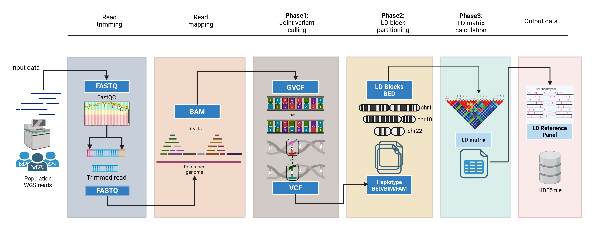

# Comprehensive pipeline for creating LD-based reference panel


We present a comprehensive pipeline to creating Linkage Disequilibrium (LD)-based reference panel from whole genome sequencing (WGS) paired-end reads. The pipeline expects whole genome paired-end reads (R1/R2) in `.fastq (or, .fastq.gz)` and the final output will be an LD-based reference panel in HDF5 format. 
Broadly, the pipeline is divided into three main phases:
* Joint calling phase
* LD-block partitioning phase
* LD calculation and reference panel creation phase

Below, we explain how to start with the required tools, set the working directory, prepare input files and run the scripts.
## Required tools
The tools included in this pipeline are listed sequentially. Make sure these tools are pre-installed. If not, please run the `install.sh` file to install them beforehand. We assume the user has a UNIX environment. We tested the pipeline in Ubuntu 22.04 AMD64 (x86_64) architecture If using CentOS, `module load anaconda` might be necessary after installation.

| Tools | Description |
| --- | --- |
| [FastQC](https://www.bioinformatics.babraham.ac.uk/projects/fastqc/) | Quality control of paired-end `fastq' files |
| [MultiQC](https://multiqc.info/) | Aggregated quality report |
| [fastp](https://github.com/OpenGene/fastp) | Read trimming in batch |
| [BWA](https://bio-bwa.sourceforge.net/) | Read mapping to reference genome |
| [Samtools](https://www.htslib.org/) | Sorting and indexing alignment files |
| [GATK v4.6.0](https://gatk.broadinstitute.org/hc/en-us) | Toolkit for various functions e.g. mark duplicates, base recalibration, variant calling |
| [PLINK v2.0](https://www.cog-genomics.org/plink/2.0/) | Genotype file conversion, LD calculation |
| [bcftools](https://samtools.github.io/bcftools/howtos/index.html) | VCF file manipulation |      
| [snpflip](https://github.com/biocore-ntnu/snpflip) | Correcting strand flipping and allele swap |
| [LDetect](https://bitbucket.org/nygcresearch/ldetect/src/master/) | LD Block partitioning | 

## Set the working directory
We assume per sample paired-end reads i.e. `*R1.fastq` and `*R2.fastq` are in the `reads/` directory. The required human genome reference (GRCh37/38) in FASTA and dnSNP [build 156](https://ftp.ncbi.nih.gov/snp/archive/b156/VCF/) known sites in VCF should be placed in the `reference/` directory. Please make directories for each step by the following command: 
```
mkdir reference reads quality trimmed_reads sam bam sorted_bam dupl_bam bqsr_bam gvcf vcf plink_binary geno_qc ld_blk ld_ref
```
The `joint_calling.sh` script also creates the directories, so if you decide simply to run the joint calling script, you can skip the above command. 

## Prepare input data
**Dataset**:

1000 Genomes Project Phase 3: Publicly available phased genotype data subsetted into chromosomes.
Link: https://ftp.1000genomes.ebi.ac.uk/vol1/ftp/release/20130502/.

South Asian LD reference panel: Publicly available LD reference panel for South Asian population derived from 1000 Genomes Project phase 3 genotype data.
Link: https://github.com/getian107/PRScs

Recombination Map: A high-resolution recombination map file already computed from the 1000G SAS.
Link: https://github.com/popgenmethods/pyrho.

The only initial step needed is to index the reference genome by `bwa index` and `samtools faidx` as they are needed while running these commands during read mapping and alignment sorting. For joint calling, an additional step of creating a sequence dictionary is needed using `GATK CreateSequenceDictionary`. 
```
genome_dir="reference"
genome='reference/<ref>.fa    # point towards reference fasta file
bwa index $genome
samtools faidx $genome
gatk4 CreateSequenceDictionary R=$genome O=$genome_dir/<ref>.dict
```
## Run the scripts
### Quality check before joint calling:
Run the quality check to perform the steps one by one: quality check by Fastqc, multi-sample aggregated quality report by MultiQC and read trimming by fastp. If read qualities are okay, then no need for trimming and in that case, comment out the fastp command line. Follow the below code block and execute each command.
```
find ./reads -name "*_R1.fastq.gz" > ./reads/samples.txt
cat ./reads/samples.txt | parallel -j 2 "fastqc {} --outdir ./quality" # FASTQC in parallel 
multiqc ./reads/ --interactive -n "Aggregated_QC_Summary" -o ./quality/    # MultiQC
cat samples.txt | parallel --progress --eta -j 10 "fastp -i reads/{}_R1.fastq.gz -I reads/{}_R2.fastq.gz -o trimmed_reads/{}_R1.trim.fastq.gz -O trimmed_reads/{}_R2.trim.fastq.gz"
```
The quality reports will be dumped in the `quality/` directory. 

### Joint calling:
After all the trimmed reads are deposited in the `trimmed_reads` directory, run `bash joint_calling.sh` command to execute joint calling step over multiple samples. The script takes trimmed reads from each sample and then aligns them with the reference genome, marks duplicate reads, and recalibrates base calls and calls variants per sample before finally perform joint calling over all samples. These include the commands: `bwa mem`, `samtools view`, `samtools sort`, `samtools index`, `gatk4 MarkDuplicatesSpark`, `gatk4 BaseRecalibrator`, `gatk4 ApplyBQSR`, `gatk4 HaplotypeCaller`, `gatk4 GenomicsDBImport` and `gatk4 GenotypeGVCFs` one after another. 

**Note:** We parallelized this process with the GNU `parallel` command taking 10 concurrent jobs and adjusted the number of threads as per our in-house server. Users are advised to calculate these parameters according to the memory allocation their system permits. 

The joint calling will yield multi-sample VCF files in `vcf/` directory split over chromosomes. During the `GenotypeGVCFs` execution, we only included 22 autosomes while sex-chromosomes and mDNA were excluded. ***This step is computationally intensive and may take several days depending on file sizes and number of samples***. 

### LD-block partitioning: 
The first step here is to convert the genotyped VCF files into PLINK binary (bed,bim,fam) files. The pipeline expects PLINK files to be in the sub-directories specified by each chromosome inside the `plink_binary/` directory. To do this run the command below
```
for n in {1..22}; do 
  mkdir -p plink_binary/chr$n 
  plink2 --vcf vcf/chr$n.vcf --double-id --export ped --make-bed --out plink_binary/chr$n/chr$n 
done
```
You can also run `bash plink_bn.sh` command for the same. 

***Caution:*** It is quite common that during file conversion to plink binaries, allele swap happens. PLINK2 treats **minor allele as A1 and major allele as A2**. The current release of PLINK2 does not affect on `--keep-allele-order` flag as it handles A1/A2 alleles separately from **'reference allele'**. If you are still using PLINK1.9, use ``plink --keep-allele-order`` option to prevent allele swap. To check whether there had been allele swap or strand flipping we recommend using the commands beforehand:
```
bcftools +fixref chr<n>.vcf -- -f $genome # check for REF/ALT flip
snpflip --fasta-genome=$genome --bim-file=chr<n> -o chr<n> # correct the swap if needed
```
Following this step, run `bash geno_qc.sh` command to execute a quality control of the genotyped data. We used standard thresholds for QC step i.e. to filter out varianta with Sample missing rate > 1% `--mind 0.01`, SNP missing rate > 1% `--geno 0.01`, minor allele frequency `--maf 0.01`, Hardy-Weinberg Equilibrium < 10<sup>-6</sup> `--hwe 1e-6` and heterozygosity exceeding +3SD. The clean variants for each chromosome will be put in the `geno_qc` directory under the corresponding chromosomes.    

In the next step, we provided an R-script `interpolate_recomb.R` to interpolate the recombination rates (in cM) from known genetic distances between HapMap variants. This is required as during the conversion of plink binaries from VCF the genetic distance (cM) information in the *.map* file is lost. We used known recombination rates for the 1000G **South Asian (SAS)** populations available at [Pyrho recombination map](https://github.com/popgenmethods/pyrho?tab=readme-ov-file#human-recombination-maps) repository. Download the recombination map files beforehand
```
wget https://zenodo.org/records/11437540/files/hg38_maps.tar.gz # hg38 build
wget https://zenodo.org/records/11437540/files/hg19_maps.tar.gz # hg19 build
```

Run `R --vanilla > interpolate_recomb.R` command to interpolate the genetic distances between the variants from VCF files to tab-separated text files. The first column of the output file is chromosome name, second column is the position of the variant in bp and the third column is the recombination rate in cM which looks like this:
```
chr1	817186	0.00923521100938176
chr1	817341	0.00956903976555111
chr1	833068	1.93947091863448
chr1	841166	1.94334976267245
chr1	863579	1.96432080949882
```
**Note:** This script is based on 1000G SAS subpopulations i.e. **BEB**, **GIH**, **PJL**, **ITU** and **STU**. If you have different population to work with, change the last code of the script accordingly, like, 
```
for(i in paste0("chr", 1:22))
    for(j in c("BEB","PJL","GIH","STU","ITU")) # change this line as, "for(j in c("<your_pop_code>"))"
        runIt(i,j)
```

This will produce `.tab.gz` files for each chromosome which will be used as input in **LDetect**. 
In the final step run the `block_partition.sh` file to execute LDetect. This step is complicated as it needs five substeps to complete by executing five Python-written files. See [LDetect page](https://bitbucket.org/nygcresearch/ldetect/src/master/) for more information. As you install the LDetect package, it automatically downloads these python files. LDetect expects directories to be arranged in a specific manner, so we have incorporated the layout in the `block_partition.sh` script. Overall, the output of each substep will be dumped into specific sub-directories as LDetect requires. The final output i.e. LD blocks for each chromosome will be written in `bed` files in the respective `chr<n>/` directories. The **BED** files will look this: 
```
CHROM	start		end
chr1	16103	1170099
chr1	1170099	2047216
chr1	2047216	3356191
chr1	3356191	4941428
chr1	4941428	5842254
```
The 'start' column is the start bp of a block and 'end' column is the corresponding end bp.
**Note:** We recommend to run the `bash block_partition.sh` command in a new screen.
```
screen -S partblocks
bash block_partition.sh
```

### LD calculation:
When the block partitioning is done, the final phase calculates LD matrices for each block. Upon running the `bash calc_LD.sh` command will first inspect the LD block ranges for each chromosome, then take the genotype data from the same directory, calculate the LD matrix for each block and finally deposit the matrices in the `ld_ref/` directory. When complete, `ld_ref` directory will have 22 sub-directories for 22 autosomes each containing further `block/` sub-directories. The output matrix, named like **block<n>.ld** will be in each corresponding to each block. 

Finally, we provided a Python script `CreateHDF5Panel.py` to transform the LD matrices for each chromosome into an HDF5 hierarchical data structure and zip all 22 HDF files into a single **LD Reference Panel**. Place the script at `ld_ref/` directory.  

## Technical additions
1. LDetect uses several python-written scripts step-by-step and requires a virtual environment setup. Please see the `install.sh` script where code is given to create a virtual environment by `pip`.
2. We made a few changes in the LDetect Python scripts. The `P00_00_partition_chromosome.py` file by default fragments chromosomes in blocks with 5000 SNPs (N). For our data, we reduced it to 500. If user has genotype data with high coverage, it is recommended first to calculate the average number of SNPs per chromosome and set `N` that balances the number of blocks and SNPs per block.
```
infile = gzip.open(sys.argv[1])
nind = float(sys.argv[2])
outfile = open(sys.argv[3], "w")
N = 500
```  
3. Line 126-132 in `P00_01_calc_covariance.py` script inspect individual genotypes from input VCF files.
```
for ind in inds:
                index = ind2index[ind]
                tmpg = line[index]
                tmpg = tmpg.split(":")[0]
                g = tmpg.split("/")
                h.append(g[0])
                h.append(g[1])
```

We changed the `g` variable in Line 130 from the default "|" to "/" as our VCF genotype was unphased. If you have phased genotype data, please change it to "|". 

4. There seems to be a bug present in the `P03_extract_bpoints.py` file. To avoid possible error, please comment out lines 103-104
```

metric_out_uniform_local_search = apply_metric(chr_name, begin, end, config, breakpoint_loci_uniform_local_search['loci'])
flat.print_log_msg('Global metric:')
print_metric(metric_out_uniform_local_search)
```
and also from line 67-78
```

# METRIC FOR UNIFORM BREAKPOINTS
flat.print_log_msg('* Calculating metric for uniform breakpoints...')
# step = int((end-begin)/(len(breakpoint_loci)+1))
# breakpoint_loci_uniform = [l for l in range(begin+step, end-step+1, step)] 
step = int(len(init_array_x)/(len(breakpoint_loci)+1))
breakpoint_loci_uniform = [init_array_x[i] for i in range(step, len(init_array_x)-step+1, step)]

# metric_out_uniform = apply_metric(chr_name, begin, end, cnst.const[dataset], breakpoint_loci_uniform)
metric_out_uniform = apply_metric(chr_name, begin, end, config, breakpoint_loci_uniform)
flat.print_log_msg('Global metric:')
print_metric(metric_out_uniform)
```


